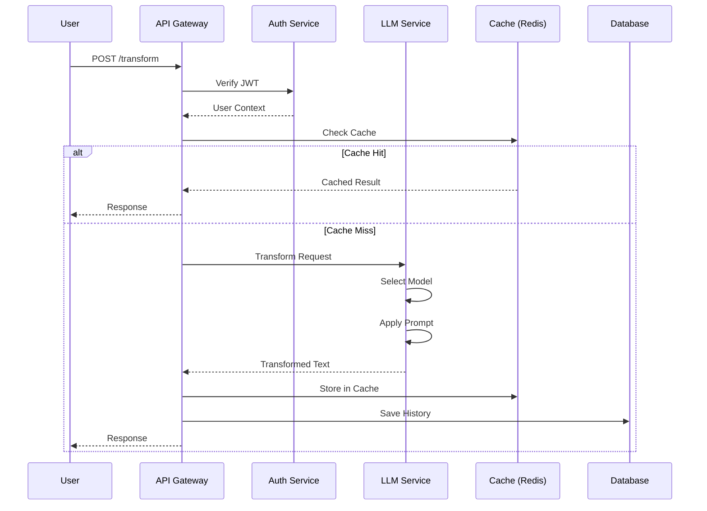

# システムアーキテクチャ仕様書

## 1. 概要

ToneBridgeは、エンジニアと非エンジニア間のコミュニケーションギャップを解消するAI駆動型プラットフォームです。マイクロサービスアーキテクチャを採用し、高い拡張性と可用性を実現しています。

## 2. アーキテクチャ概要

### 2.1 全体構成

```
┌─────────────────────────────────────────────────────────────┐
│                         Users                                │
│  (Web Browser, Mobile App, Slack, Teams, Discord, API)      │
└──────────────────────────┬──────────────────────────────────┘
                           │
                           ▼
┌─────────────────────────────────────────────────────────────┐
│                    CDN / WAF Layer                           │
│                    (CloudFlare)                              │
└──────────────────────────┬──────────────────────────────────┘
                           │
                           ▼
┌─────────────────────────────────────────────────────────────┐
│                    Load Balancer                             │
│                 (Nginx / HAProxy / ALB)                      │
└──────────────────────────┬──────────────────────────────────┘
                           │
         ┌─────────────────┼─────────────────┐
         ▼                 ▼                 ▼
┌────────────────┐ ┌────────────────┐ ┌────────────────┐
│  API Gateway   │ │  API Gateway   │ │  API Gateway   │
│   (Golang)     │ │   (Golang)     │ │   (Golang)     │
└────────────────┘ └────────────────┘ └────────────────┘
         │                 │                 │
         └─────────────────┼─────────────────┘
                           │
    ┌──────────────────────┼──────────────────────┐
    ▼                      ▼                      ▼
┌──────────┐        ┌──────────┐          ┌──────────┐
│   LLM    │        │Analytics │          │   Auth   │
│ Service  │        │ Service  │          │ Service  │
│(Python)  │        │ (Golang) │          │ (Golang) │
└──────────┘        └──────────┘          └──────────┘
    │                      │                      │
    └──────────────────────┼──────────────────────┘
                           │
    ┌──────────────────────┼──────────────────────┐
    ▼                      ▼                      ▼
┌──────────┐        ┌──────────┐          ┌──────────┐
│PostgreSQL│        │  Redis   │          │    S3    │
│    DB    │        │  Cache   │          │ Storage  │
└──────────┘        └──────────┘          └──────────┘
```

### 2.2 レイヤー構成

| レイヤー | 責務 | 技術スタック |
|---------|------|-------------|
| **プレゼンテーション層** | UI/UX提供 | HTML/CSS/JavaScript, React, Vue.js |
| **API Gateway層** | ルーティング、認証、レート制限 | Golang (Fiber v3) |
| **ビジネスロジック層** | 中核ビジネス処理 | Golang, Python |
| **データアクセス層** | データ永続化、キャッシング | PostgreSQL, Redis |
| **インフラストラクチャ層** | 基盤サービス | Docker, Kubernetes, AWS/GCP/Azure |

## 3. コンポーネント詳細

### 3.1 API Gateway

**責務：**
- リクエストルーティング
- 認証・認可
- レート制限
- リクエスト/レスポンス変換
- サーキットブレーカー
- ロードバランシング

**技術仕様：**
```go
// Fiber v3フレームワーク使用
type Gateway struct {
    Router        *fiber.App
    AuthService   AuthServiceInterface
    RateLimiter   RateLimiterInterface
    CircuitBreaker CircuitBreakerInterface
    Logger        LoggerInterface
}
```

**エンドポイント構成：**
```
/api/v1/
├── auth/
│   ├── register
│   ├── login
│   ├── refresh
│   └── logout
├── transform/
│   ├── tone
│   ├── structure
│   ├── summarize
│   └── terminology
├── analyze/
│   ├── tone
│   ├── structure
│   └── priority
├── history/
│   ├── list
│   └── detail/:id
└── dictionaries/
    ├── list
    ├── create
    ├── update/:id
    └── delete/:id
```

### 3.2 LLM Service

**責務：**
- テキスト変換処理
- プロンプトエンジニアリング
- モデル選択とフォールバック
- レスポンスキャッシング

**アーキテクチャ：**
```python
class LLMService:
    def __init__(self):
        self.providers = {
            'openai': OpenAIProvider(),
            'anthropic': AnthropicProvider(),
            'google': GoogleProvider()
        }
        self.cache = RedisCache()
        self.fallback_strategy = FallbackStrategy()
    
    async def transform(self, request: TransformRequest) -> TransformResponse:
        # キャッシュチェック
        cached = await self.cache.get(request.cache_key)
        if cached:
            return cached
        
        # プロバイダー選択とフォールバック
        for provider in self.fallback_strategy.get_providers():
            try:
                result = await provider.transform(request)
                await self.cache.set(request.cache_key, result)
                return result
            except Exception as e:
                logger.warning(f"Provider {provider} failed: {e}")
                continue
        
        raise AllProvidersFailedError()
```

### 3.3 認証サービス

**責務：**
- ユーザー認証
- JWT生成・検証
- セッション管理
- 権限管理

**フロー：**
```
1. ユーザーログイン
   └→ 認証情報検証
      └→ JWT生成（アクセス + リフレッシュトークン）
         └→ Redisセッション保存
            └→ トークン返却

2. APIアクセス
   └→ JWTトークン検証
      └→ セッション確認
         └→ 権限チェック
            └→ リクエスト処理
```

### 3.4 データベース設計

**主要テーブル：**
```sql
-- 組織テーブル
organizations (
    id UUID PRIMARY KEY,
    name VARCHAR(255),
    plan VARCHAR(50),
    settings JSONB
)

-- ユーザーテーブル
users (
    id UUID PRIMARY KEY,
    organization_id UUID REFERENCES organizations,
    email VARCHAR(255) UNIQUE,
    role VARCHAR(50)
)

-- 変換履歴（パーティション）
transformations (
    id UUID,
    user_id UUID,
    original_text TEXT,
    transformed_text TEXT,
    created_at TIMESTAMP
) PARTITION BY RANGE (created_at);

-- ベクトル埋め込み
embeddings (
    id UUID PRIMARY KEY,
    text_hash VARCHAR(64),
    embedding vector(1536)
)
```

## 4. データフロー

### 4.1 変換リクエストフロー



### 4.2 リアルタイム処理フロー

```
WebSocket Connection
│
├→ Socket.IO Server
│  ├→ Authentication
│  ├→ Room Management
│  └→ Event Handling
│
├→ Message Queue (Redis Pub/Sub)
│  ├→ Transform Events
│  ├→ Broadcast Events
│  └→ Status Updates
│
└→ Stream Processing
   ├→ Chunked Responses
   ├→ Progress Updates
   └→ Error Handling
```

## 5. 非機能要件対応

### 5.1 スケーラビリティ

**水平スケーリング戦略：**
- **API Gateway**: ステートレス設計により無制限スケール可能
- **LLM Service**: ワーカープール方式で並列処理
- **Database**: Read Replicaとパーティショニング
- **Cache**: Redis Clusterによる分散キャッシング

**垂直スケーリング：**
- コンテナリソース制限の動的調整
- データベース接続プールサイズの最適化
- メモリキャッシュサイズの調整

### 5.2 可用性

**高可用性設計：**
```yaml
availability_targets:
  overall_sla: 99.9%
  api_gateway: 99.95%
  database: 99.99%
  cache: 99.9%

strategies:
  - multi_region_deployment
  - auto_failover
  - health_checks
  - circuit_breakers
  - graceful_degradation
```

**障害対応：**
- **サーキットブレーカー**: 連続失敗時の自動遮断
- **リトライ機構**: 指数バックオフ付き再試行
- **フォールバック**: 代替LLMプロバイダー自動切り替え
- **グレースフルデグレード**: 機能制限モード

### 5.3 パフォーマンス

**最適化戦略：**
1. **キャッシング階層**
   - L1: アプリケーション内メモリ (LRU)
   - L2: Redis分散キャッシュ
   - L3: CDN エッジキャッシュ

2. **データベース最適化**
   - インデックス最適化
   - クエリ最適化
   - 接続プーリング
   - パーティショニング

3. **非同期処理**
   - メッセージキューによる非同期化
   - バッチ処理
   - ストリーミングレスポンス

### 5.4 セキュリティ

**セキュリティレイヤー：**
```
[Internet]
    │
    ├─ WAF (Web Application Firewall)
    │   └─ DDoS Protection
    │       └─ Rate Limiting
    │
    ├─ TLS/SSL Termination
    │
    ├─ API Gateway Security
    │   ├─ JWT Authentication
    │   ├─ API Key Validation
    │   └─ RBAC Authorization
    │
    ├─ Application Security
    │   ├─ Input Validation
    │   ├─ Output Encoding
    │   └─ CSRF Protection
    │
    └─ Data Security
        ├─ Encryption at Rest
        ├─ Encryption in Transit
        └─ Key Management (KMS)
```

## 6. デプロイメントアーキテクチャ

### 6.1 コンテナオーケストレーション

```yaml
# Kubernetes Deployment Architecture
namespaces:
  - production
  - staging
  - development

workloads:
  api-gateway:
    replicas: 3-10 (HPA)
    resources:
      requests: {cpu: 500m, memory: 512Mi}
      limits: {cpu: 1000m, memory: 1Gi}
    
  llm-service:
    replicas: 2-5 (HPA)
    resources:
      requests: {cpu: 1000m, memory: 1Gi}
      limits: {cpu: 2000m, memory: 2Gi}
    
  database:
    type: StatefulSet
    replicas: 1 (primary) + 2 (replicas)
    storage: 100Gi SSD
```

### 6.2 CI/CDパイプライン

```
[Code Push] → [GitHub]
                 │
                 ├→ [CI Pipeline]
                 │   ├→ Lint & Format
                 │   ├→ Unit Tests
                 │   ├→ Integration Tests
                 │   ├→ Security Scan
                 │   └→ Build Docker Image
                 │
                 ├→ [CD Pipeline]
                 │   ├→ Push to Registry
                 │   ├→ Deploy to Staging
                 │   ├→ Run E2E Tests
                 │   ├→ Canary Deployment
                 │   └→ Full Production Rollout
                 │
                 └→ [Monitoring]
                     ├→ Health Checks
                     ├→ Metrics Collection
                     └→ Alert Management
```

## 7. 監視とロギング

### 7.1 メトリクス収集

```yaml
metrics:
  application:
    - request_rate
    - response_time
    - error_rate
    - transformation_count
    - cache_hit_rate
  
  infrastructure:
    - cpu_usage
    - memory_usage
    - disk_io
    - network_throughput
    - container_restarts
  
  business:
    - daily_active_users
    - transformation_success_rate
    - api_usage_by_plan
    - revenue_metrics
```

### 7.2 ログアーキテクチャ

```
Application Logs → Fluentd → Elasticsearch → Kibana
     │                           │
     │                           └→ S3 (Archive)
     │
     └→ Structured Logging (JSON)
         ├─ trace_id
         ├─ span_id
         ├─ user_id
         ├─ timestamp
         └─ metadata
```

## 8. 災害復旧

### 8.1 バックアップ戦略

| コンポーネント | バックアップ頻度 | 保持期間 | RPO | RTO |
|--------------|---------------|---------|-----|-----|
| Database | 1時間ごと（増分）| 30日 | 1時間 | 2時間 |
| Database | 日次（フル） | 90日 | 24時間 | 4時間 |
| Redis | 1時間ごと | 7日 | 1時間 | 30分 |
| Object Storage | リアルタイム | 無期限 | 0 | 即時 |

### 8.2 フェイルオーバー手順

```bash
# 自動フェイルオーバー設定
failover_config:
  detection_time: 30s
  switchover_time: 60s
  
  steps:
    1. Health check failure detection
    2. Verify failure (avoid false positive)
    3. Promote standby to primary
    4. Update DNS/Load Balancer
    5. Notify operations team
    6. Start recovery process
```

## 9. 拡張ポイント

### 9.1 プラグインアーキテクチャ

```go
type Plugin interface {
    Name() string
    Version() string
    Initialize(config map[string]interface{}) error
    Execute(context Context, input interface{}) (interface{}, error)
    Shutdown() error
}

type PluginManager struct {
    plugins map[string]Plugin
    
    func Register(plugin Plugin)
    func Execute(name string, input interface{}) (interface{}, error)
    func List() []PluginInfo
}
```

### 9.2 イベント駆動アーキテクチャ

```python
class EventBus:
    def __init__(self):
        self.subscribers = defaultdict(list)
    
    def subscribe(self, event_type: str, handler: Callable):
        self.subscribers[event_type].append(handler)
    
    async def publish(self, event: Event):
        for handler in self.subscribers[event.type]:
            await handler(event)

# イベント定義
events = {
    'transformation.started',
    'transformation.completed',
    'transformation.failed',
    'user.registered',
    'user.upgraded',
    'quota.exceeded'
}
```

## 10. 技術選定理由

### 10.1 言語選択

| 言語 | 用途 | 選定理由 |
|------|-----|---------|
| **Golang** | API Gateway, マイクロサービス | 高性能、並行処理、静的型付け |
| **Python** | LLMサービス、ML処理 | 豊富なAI/MLライブラリ、LangChain対応 |
| **TypeScript** | フロントエンド | 型安全性、大規模開発対応 |
| **SQL** | データベース | 標準化、ACID特性 |

### 10.2 フレームワーク選択

| フレームワーク | 用途 | 選定理由 |
|--------------|-----|---------|
| **Fiber v3** | Web Framework (Go) | 高速、Express風API、WebSocket対応 |
| **FastAPI** | Web Framework (Python) | 非同期対応、自動ドキュメント生成 |
| **LangChain** | LLM Framework | マルチプロバイダー対応、チェーン構築 |
| **React/Vue** | Frontend | コンポーネント指向、エコシステム |

## まとめ

ToneBridgeのシステムアーキテクチャは、マイクロサービスアーキテクチャを基盤とし、高い拡張性、可用性、保守性を実現しています。各コンポーネントは疎結合で設計され、独立したスケーリングとデプロイメントが可能です。継続的な改善により、ユーザーに安定した高品質なサービスを提供します。
