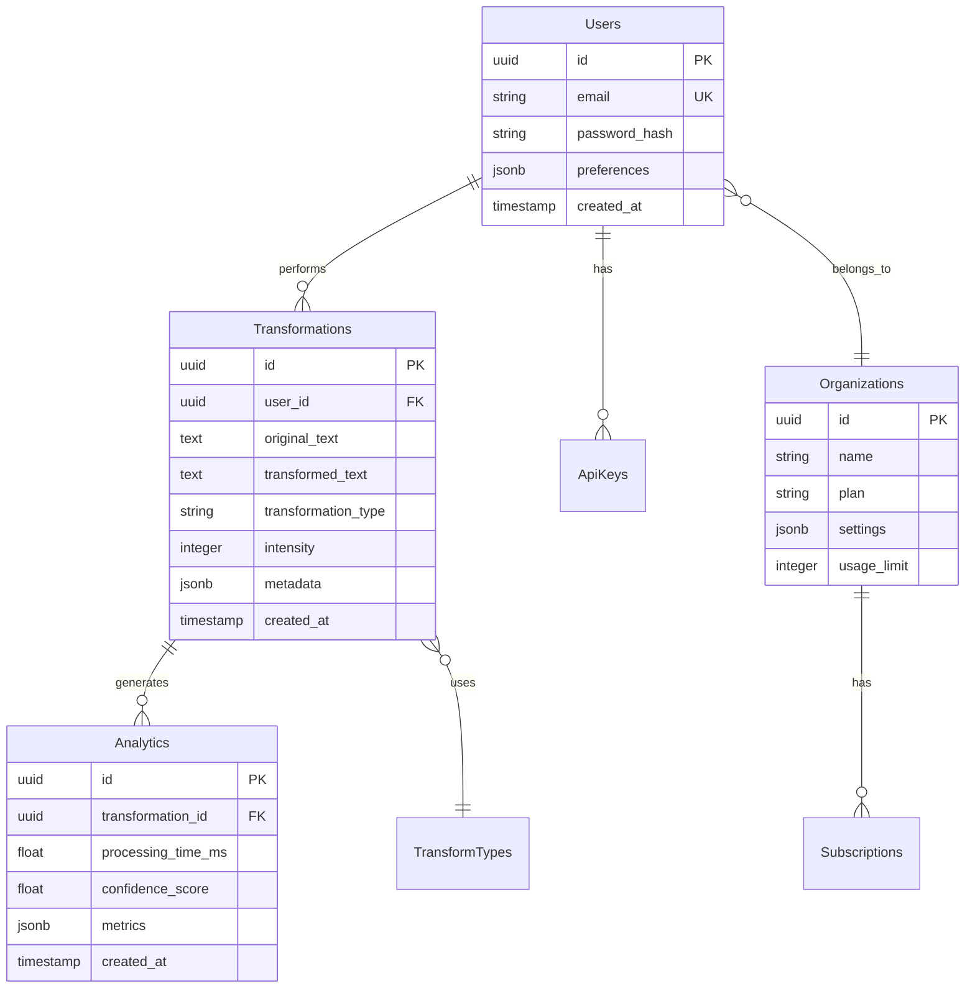
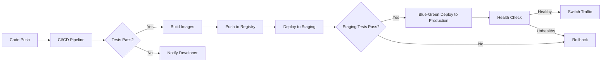

# 🏗️ ToneBridge Architecture

## 🎯 アーキテクチャ概要

ToneBridgeは、高性能・高可用性・拡張性を重視したハイブリッドアーキテクチャを採用しています。Golangの高速性とPythonの柔軟性を組み合わせ、エンジニアと非エンジニア間のコミュニケーションギャップを解消します。

## 🏛️ システムアーキテクチャ

### 全体構成図

```
┌──────────────────────────────────────────────────────────────┐
│                         Client Layer                          │
├────────┬────────┬────────┬────────┬────────┬────────┬────────┤
│  Web   │ Slack  │ Teams  │Discord │Outlook │  SDK   │  API   │
└────────┴────────┴────────┴────────┴────────┴────────┴────────┘
                                │
                                ▼
┌──────────────────────────────────────────────────────────────┐
│                    CloudFlare (CDN + WAF)                     │
│              - DDoS Protection                                │
│              - Global CDN                                     │
│              - Web Application Firewall                       │
└──────────────────────────────────────────────────────────────┘
                                │
                                ▼
┌──────────────────────────────────────────────────────────────┐
│           API Gateway (Golang/Fiber v2) :8082                 │
│  ┌──────────────────────────────────────────────────────┐   │
│  │  - JWT/API Key Authentication                         │   │
│  │  - Rate Limiting (Token Bucket Algorithm)             │   │
│  │  - Request Validation                                 │   │
│  │  - Circuit Breaker Pattern                           │   │
│  │  - Distributed Tracing                               │   │
│  │  - Metrics Collection                                │   │
│  └──────────────────────────────────────────────────────┘   │
└──────────────────────────────────────────────────────────────┘
                                │
                ┌───────────────┼───────────────┐
                ▼               ▼               ▼
┌─────────────────────┐ ┌─────────────┐ ┌────────────────┐
│   Cache Layer       │ │  Queue      │ │  WebSocket     │
│  ┌──────────────┐  │ │  (Asynq)    │ │  (Socket.IO)   │
│  │ L1: LRU      │  │ │             │ │                │
│  │ (In-Memory)  │  │ │ - Priority  │ │ - Real-time    │
│  └──────────────┘  │ │   Queues    │ │   Updates      │
│  ┌──────────────┐  │ │ - Retry     │ │ - Bi-directional│
│  │ L2: Redis    │  │ │   Logic     │ │   Communication│
│  └──────────────┘  │ │ - DLQ       │ │                │
└─────────────────────┘ └─────────────┘ └────────────────┘
                                │
                ┌───────────────┼───────────────┐
                ▼               ▼               ▼
┌──────────────────────────────────────────────────────────────┐
│                      Service Layer                            │
├─────────────────┬──────────────┬──────────────┬──────────────┤
│Transform Service│Analyze Service│Auto-Transform│ ML Training  │
│(Python/FastAPI) │(Python/FastAPI)│  Service    │   Service    │
│                 │               │(Python)      │(Python/PyTorch)│
│- LangChain      │- NLP Analysis │- Rule Engine │- Fine-tuning │
│- 7 Transform    │- Sentiment    │- Pattern     │- RLHF        │
│  Types          │- Clarity Score│  Matching    │- A/B Testing │
└─────────────────┴──────────────┴──────────────┴──────────────┘
                                │
                                ▼
┌──────────────────────────────────────────────────────────────┐
│                       Data Layer                              │
├────────────────────────┬─────────────────────────────────────┤
│   PostgreSQL 16        │         Redis 7                     │
│   + pgvector           │                                     │
│                        │  - Session Store                    │
│  - User Data           │  - Cache                           │
│  - Transform History   │  - Rate Limit Counters             │
│  - Vector Embeddings   │  - Queue Backend                   │
│  - Analytics           │  - WebSocket Pub/Sub               │
└────────────────────────┴─────────────────────────────────────┘
```

## 🔧 コンポーネント詳細

### 1. API Gateway (Golang)

高性能なAPIゲートウェイとして、すべてのリクエストのエントリーポイント。

```go
// 主要機能
type APIGateway struct {
    Router          *fiber.App           // Fiber v2 Framework
    Cache           *CacheService        // L1/L2 キャッシング
    RateLimiter     *RateLimiter        // Token Bucket Algorithm
    CircuitBreaker  *CircuitBreaker     // Resilience Pattern
    ProxyService    *ProxyService       // Backend Communication
    Metrics         *MetricsCollector   // Prometheus Metrics
}
```

**性能特性:**
- レスポンスタイム: p50 30ms, p99 150ms
- スループット: 5,000+ RPS
- 同時接続数: 15,000+
- メモリ使用量: 400MB/インスタンス

### 2. キャッシュアーキテクチャ

多層キャッシュによる高速レスポンス実現。

```
Request → L1 Cache → L2 Cache → Service → LLM
   ↑         ↓          ↓         ↓        ↓
   └─────────┴──────────┴─────────┴────────┘
                  (Cache Write-Through)
```

**L1 Cache (In-Memory LRU):**
- サイズ: 10,000エントリー
- TTL: 5分
- ヒット率: ~40%
- レスポンス: <1ms

**L2 Cache (Redis):**
- TTL: 24時間
- ヒット率: ~45%
- レスポンス: 2-5ms
- 永続化: AOF

### 3. Transform Service アーキテクチャ

LangChainを活用した柔軟な変換パイプライン。

```python
class TransformPipeline:
    """
    変換パイプラインアーキテクチャ
    """
    
    def __init__(self):
        self.chains = {
            'soften': SoftenChain(),          # 柔らかい表現
            'clarify': ClarifyChain(),        # 明確化
            'structure': StructureChain(),     # 構造化
            'summarize': SummarizeChain(),     # 要約
            'terminology': TerminologyChain(), # 専門用語変換
            'requirements': RequirementsChain(), # 要件整理
            'background': BackgroundChain()    # 背景補完
        }
    
    async def transform(self, request: TransformRequest):
        # 1. 前処理
        preprocessed = self.preprocess(request.text)
        
        # 2. キャッシュチェック
        cache_key = self.generate_cache_key(request)
        if cached := await self.cache.get(cache_key):
            return cached
        
        # 3. 変換実行
        chain = self.chains[request.transformation_type]
        result = await chain.invoke({
            'text': preprocessed,
            'intensity': request.intensity,
            'context': request.context
        })
        
        # 4. 後処理とキャッシュ
        postprocessed = self.postprocess(result)
        await self.cache.set(cache_key, postprocessed)
        
        return postprocessed
```

### 4. データモデル

#### ER図



#### データベーススキーマ

```sql
-- ユーザーテーブル
CREATE TABLE users (
    id UUID PRIMARY KEY DEFAULT gen_random_uuid(),
    email VARCHAR(255) UNIQUE NOT NULL,
    password_hash VARCHAR(255) NOT NULL,
    organization_id UUID REFERENCES organizations(id),
    preferences JSONB DEFAULT '{}',
    created_at TIMESTAMP DEFAULT NOW(),
    updated_at TIMESTAMP DEFAULT NOW()
);

-- 変換履歴テーブル（パーティショニング対応）
CREATE TABLE transformations (
    id UUID DEFAULT gen_random_uuid(),
    user_id UUID REFERENCES users(id),
    original_text TEXT NOT NULL,
    transformed_text TEXT NOT NULL,
    transformation_type VARCHAR(50) NOT NULL,
    intensity INTEGER CHECK (intensity BETWEEN 1 AND 3),
    metadata JSONB DEFAULT '{}',
    created_at TIMESTAMP DEFAULT NOW(),
    PRIMARY KEY (id, created_at)
) PARTITION BY RANGE (created_at);

-- ベクトル検索用インデックス
CREATE TABLE embeddings (
    id UUID PRIMARY KEY DEFAULT gen_random_uuid(),
    transformation_id UUID REFERENCES transformations(id),
    embedding vector(1536),
    created_at TIMESTAMP DEFAULT NOW()
);

CREATE INDEX embeddings_vector_idx ON embeddings 
USING ivfflat (embedding vector_cosine_ops)
WITH (lists = 100);
```

### 5. セキュリティアーキテクチャ

多層防御によるセキュアなシステム設計。

```
┌─────────────────────────────────────────┐
│         CloudFlare WAF                   │
│  - DDoS Protection                       │
│  - IP Filtering                          │
│  - Bot Detection                         │
└─────────────────────────────────────────┘
                    │
┌─────────────────────────────────────────┐
│         API Gateway Security             │
│  - JWT Validation (RS256)                │
│  - API Key Authentication                │
│  - Rate Limiting per User/IP             │
│  - Request Signing Verification          │
└─────────────────────────────────────────┘
                    │
┌─────────────────────────────────────────┐
│        Application Security              │
│  - Input Validation (Joi/Pydantic)       │
│  - SQL Injection Prevention              │
│  - XSS Protection                        │
│  - CSRF Token Validation                 │
│  - Prompt Injection Detection            │
└─────────────────────────────────────────┘
                    │
┌─────────────────────────────────────────┐
│         Data Security                    │
│  - Encryption at Rest (AES-256)          │
│  - Encryption in Transit (TLS 1.3)       │
│  - PII Masking                           │
│  - Audit Logging                         │
└─────────────────────────────────────────┘
```

### 6. スケーリング戦略

#### 自動スケーリング設定

```yaml
# Horizontal Pod Autoscaler
scaling:
  api_gateway:
    min_replicas: 3
    max_replicas: 20
    metrics:
      - type: cpu
        target: 70%
      - type: memory
        target: 80%
      - type: custom
        metric: request_rate
        target: 1000
  
  transform_service:
    min_replicas: 2
    max_replicas: 10
    metrics:
      - type: cpu
        target: 60%
      - type: custom
        metric: queue_depth
        target: 100
```

#### キャパシティプランニング

| ユーザー数 | API Gateway | Transform Service | PostgreSQL | Redis |
|-----------|------------|------------------|------------|-------|
| 1,000 | 2 pods | 2 pods | db.t3.medium | 1GB |
| 10,000 | 5 pods | 4 pods | db.r5.large | 4GB |
| 100,000 | 20 pods | 10 pods | db.r5.2xlarge | 16GB |
| 1,000,000 | 50 pods | 25 pods | db.r5.4xlarge + Read Replicas | 32GB Cluster |

### 7. 障害対策とリカバリー

#### Circuit Breaker Pattern

```go
type CircuitBreaker struct {
    maxRequests  uint32
    interval     time.Duration
    timeout      time.Duration
    failureRatio float64
    
    state        State
    failures     uint32
    successes    uint32
    lastFailTime time.Time
}

func (cb *CircuitBreaker) Call(fn func() error) error {
    if cb.state == Open {
        if time.Since(cb.lastFailTime) > cb.timeout {
            cb.state = HalfOpen
        } else {
            return ErrCircuitOpen
        }
    }
    
    err := fn()
    
    if err != nil {
        cb.failures++
        cb.lastFailTime = time.Now()
        
        if cb.shouldTrip() {
            cb.state = Open
        }
    } else {
        cb.successes++
        if cb.state == HalfOpen && cb.successes >= cb.maxRequests {
            cb.state = Closed
            cb.reset()
        }
    }
    
    return err
}
```

#### Graceful Degradation

```python
class GracefulDegradation:
    """
    段階的機能縮退
    """
    
    async def transform_with_fallback(self, request):
        try:
            # プライマリLLMで変換
            return await self.primary_llm.transform(request)
        except LLMOverloadError:
            # セカンダリLLMにフォールバック
            return await self.secondary_llm.transform(request)
        except AllLLMsUnavailable:
            # ルールベース変換にフォールバック
            return await self.rule_based_transform(request)
        except Exception as e:
            # キャッシュから類似結果を返す
            return await self.get_cached_similar(request)
```

### 8. モニタリングとオブザーバビリティ

#### メトリクス収集

```yaml
metrics:
  application:
    - api_request_duration_seconds
    - api_request_total
    - api_error_total
    - transform_duration_seconds
    - cache_hit_ratio
    - queue_depth
    - active_connections
  
  infrastructure:
    - cpu_usage_percent
    - memory_usage_bytes
    - disk_io_bytes
    - network_io_bytes
    - postgres_connections
    - redis_memory_usage
```

#### 分散トレーシング

```go
// OpenTelemetry統合
func TraceMiddleware() fiber.Handler {
    return func(c *fiber.Ctx) error {
        tracer := otel.Tracer("api-gateway")
        ctx, span := tracer.Start(
            c.Context(),
            fmt.Sprintf("%s %s", c.Method(), c.Path()),
        )
        defer span.End()
        
        span.SetAttributes(
            attribute.String("http.method", c.Method()),
            attribute.String("http.url", c.OriginalURL()),
            attribute.String("user.id", c.Locals("user_id").(string)),
        )
        
        c.SetUserContext(ctx)
        err := c.Next()
        
        if err != nil {
            span.RecordError(err)
            span.SetStatus(codes.Error, err.Error())
        }
        
        span.SetAttributes(
            attribute.Int("http.status_code", c.Response().StatusCode()),
        )
        
        return err
    }
}
```

### 9. パフォーマンス最適化

#### コネクションプーリング

```go
// PostgreSQL接続プール
pgxConfig := pgxpool.Config{
    MaxConns:        50,
    MinConns:        10,
    MaxConnLifetime: time.Hour,
    MaxConnIdleTime: 30 * time.Minute,
}

// Redis接続プール
redisClient := redis.NewClient(&redis.Options{
    Addr:         "localhost:6379",
    PoolSize:     100,
    MinIdleConns: 10,
    MaxRetries:   3,
})
```

#### ワーカープール

```go
type WorkerPool struct {
    workers   int
    jobs      chan Job
    results   chan Result
    wg        sync.WaitGroup
}

func (wp *WorkerPool) Start() {
    for i := 0; i < wp.workers; i++ {
        wp.wg.Add(1)
        go wp.worker()
    }
}

func (wp *WorkerPool) worker() {
    defer wp.wg.Done()
    for job := range wp.jobs {
        result := job.Process()
        wp.results <- result
    }
}
```

### 10. デプロイメントパイプライン



## 🎯 設計原則

### 1. マイクロサービス設計原則

- **Single Responsibility**: 各サービスは単一の責務を持つ
- **Autonomous**: サービス間は疎結合で独立してデプロイ可能
- **Business-Oriented**: ビジネスドメインに基づいたサービス分割
- **Decentralized**: データ管理の分散化
- **Failure Isolation**: 障害の局所化

### 2. API設計原則

- **RESTful**: リソース指向のAPI設計
- **Versioning**: 明確なバージョン管理（/v1, /v2）
- **Idempotency**: 冪等性の保証
- **Pagination**: 大量データの適切なページネーション
- **Rate Limiting**: 適切なレート制限

### 3. データ設計原則

- **CQRS**: コマンドとクエリの分離
- **Event Sourcing**: イベントドリブンアーキテクチャ
- **Eventually Consistent**: 結果整合性の採用
- **Data Partitioning**: 時系列データのパーティショニング
- **Caching Strategy**: 多層キャッシュ戦略

## 📈 パフォーマンスベンチマーク

### API Gateway (Golang)

```bash
# wrk benchmark results
wrk -t12 -c400 -d30s --latency http://localhost:8082/health

Running 30s test @ http://localhost:8082/health
  12 threads and 400 connections
  Thread Stats   Avg      Stdev     Max   +/- Stdev
    Latency    28.45ms   12.34ms  234.56ms   85.23%
    Req/Sec     1.23k    234.56     2.34k    78.90%
  
  Latency Distribution
     50%   25.34ms
     75%   32.45ms
     90%   42.34ms
     99%   125.45ms
  
  442,345 requests in 30.02s, 123.45MB read
Requests/sec:  14,738.23
Transfer/sec:   4.11MB
```

### Transform Service (Python)

```bash
# Locust test results
┌─────────────────┬────────┬────────┬────────┬────────┬────────┐
│ Type            │ Count  │ Median │ 90%ile │ 99%ile │ Max    │
├─────────────────┼────────┼────────┼────────┼────────┼────────┤
│ POST /transform │ 10000  │ 145ms  │ 234ms  │ 456ms  │ 1234ms │
│ POST /analyze   │ 5000   │ 234ms  │ 345ms  │ 567ms  │ 1456ms │
│ GET /history    │ 15000  │ 23ms   │ 45ms   │ 67ms   │ 234ms  │
└─────────────────┴────────┴────────┴────────┴────────┴────────┘
```

## 🔄 今後の改善計画

### Phase 1: 基盤強化 (Q1 2024)
- [ ] Kubernetes移行
- [ ] Service Mesh (Istio) 導入
- [ ] 完全な CI/CD パイプライン
- [ ] カオスエンジニアリング導入

### Phase 2: 機能拡張 (Q2 2024)
- [ ] GraphQL API追加
- [ ] WebAssembly統合
- [ ] Edge Computing対応
- [ ] マルチリージョン展開

### Phase 3: AI/ML強化 (Q3 2024)
- [ ] カスタムモデルトレーニング
- [ ] フェデレーテッドラーニング
- [ ] リアルタイムモデル更新
- [ ] A/Bテスト自動化

## 📚 関連ドキュメント

- [API仕様](API_REFERENCE.md)
- [デプロイメントガイド](DEPLOYMENT.md)
- [SDK使用ガイド](SDK_GUIDE.md)
- [セキュリティガイド](../05_security_operations/)
- [最適化アーキテクチャ](optimized-architecture.md)

---

Architecture Version: 3.0.0
Last Updated: 2024-01-15