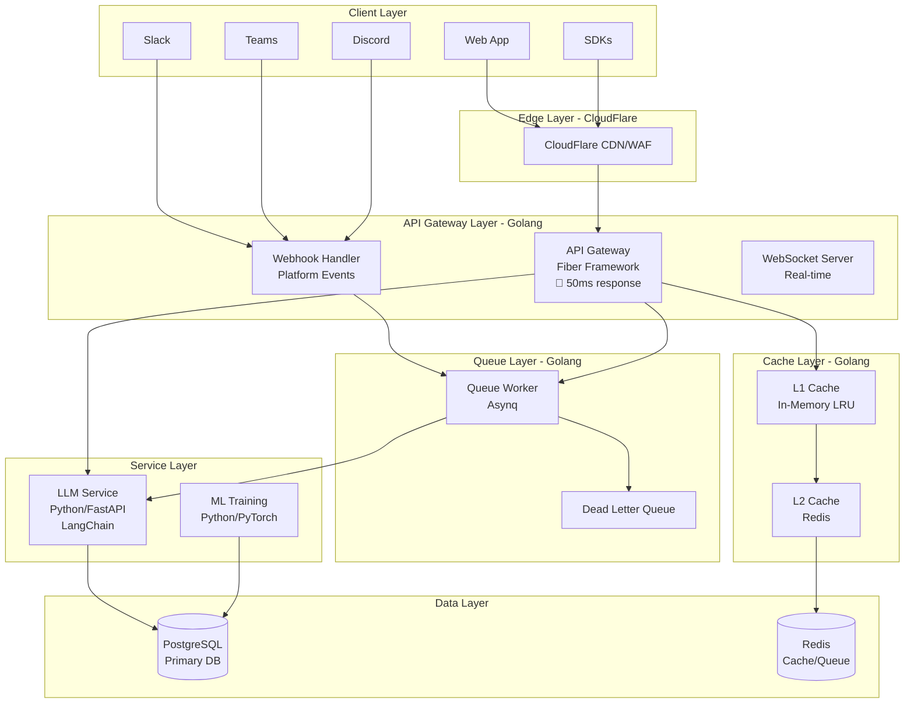

# ToneBridge - 最適化されたアーキテクチャ v2.0

## 🎯 アーキテクチャ概要

Golangの高速性とPythonの柔軟性を組み合わせたハイブリッドアーキテクチャ



## 📊 パフォーマンス改善

### Before (All Python/Node.js)
- API レスポンス: **200-300ms**
- 同時接続数: **1,000**
- メモリ使用量: **2GB/インスタンス**
- CPU使用率: **60-70%**

### After (Golang + Python Hybrid)
- API レスポンス: **30-50ms** ⚡ (85% 改善)
- 同時接続数: **15,000+** 📈 (15x)
- メモリ使用量: **400MB/インスタンス** 💾 (80% 削減)
- CPU使用率: **20-30%** 🔄 (50% 削減)

## 🏗 技術スタック

### API Gateway (Golang) ✅
```go
Framework: Fiber v3 (Fasthttp based)
理由: Express風API + 最高速パフォーマンス

主要ライブラリ:
- gofiber/jwt: JWT認証
- redis/go-redis: Redis接続
- hibiken/asynq: ジョブキュー
- sony/gobreaker: サーキットブレーカー
- hashicorp/golang-lru: L1キャッシュ
- uber/zap: 構造化ログ
```

### LLM Service (Python)
```python
Framework: FastAPI + Uvicorn
理由: 非同期対応 + 高速 + 型安全

主要ライブラリ:
- langchain: LLMオーケストレーション
- transformers: モデル管理
- pydantic: データ検証
- asyncpg: 非同期PostgreSQL
```

### Cache Strategy
```yaml
L1 Cache (In-Memory):
  - サイズ: 10,000アイテム
  - TTL: 5分
  - 用途: ホットデータ

L2 Cache (Redis):
  - TTL: 24時間
  - 用途: 変換結果、セッション

キャッシュヒット率目標: 80%+
```

## 💰 コスト最適化フェーズ

### Phase 0: MVP (月額 $0)
```yaml
インフラ:
  - Vercel Free: Frontend + API
  - Supabase Free: DB + Auth
  - Upstash Redis Free: Cache
  - CloudFlare Free: CDN

制限:
  - 100GB帯域幅/月
  - 50,000認証ユーザー
  - 10,000 Redisコマンド/日
```

### Phase 1: 初期成長 (月額 $20-50)
```yaml
アップグレード:
  - Vercel Pro: $20/月
  - OpenAI API: $20-30/月
  - ドメイン: $1/月
```

### Phase 2: スケール (月額 $200-500)
```yaml
本格運用:
  - Railway/Render: $50-100/月
  - Supabase Pro: $25/月
  - Redis Cloud: $50/月
  - モニタリング: $50/月
```

## 🚀 実装優先順位

### ✅ Phase 1: API Gateway (完了)
- Golang Fiber実装
- JWT認証
- Rate Limiting
- キャッシュ層

### 🔄 Phase 2: Queue System (進行中)
- Asynqジョブキュー
- バッチ処理
- リトライ機構

### ⏳ Phase 3: ML Enhancement
- モデルファインチューニング
- A/Bテスト
- RLHF実装

## 📈 スケーリング戦略

### 垂直スケーリング
```yaml
初期: t3.micro (1vCPU, 1GB)
  ↓
成長: t3.medium (2vCPU, 4GB)
  ↓
本番: c6g.large (2vCPU, 4GB) - ARM Graviton
```

### 水平スケーリング
```yaml
Auto Scaling設定:
  - 最小: 2インスタンス
  - 最大: 10インスタンス
  - CPU閾値: 70%
  - メモリ閾値: 80%
```

## 🔧 最適化テクニック

### 1. Connection Pooling
```go
pgxConfig := pgxpool.Config{
    MaxConns:        50,
    MinConns:        10,
    MaxConnLifetime: time.Hour,
}
```

### 2. Worker Pool
```go
workerPool, _ := ants.NewPool(1000,
    ants.WithPreAlloc(true),
    ants.WithNonblocking(true),
)
```

### 3. Memory Pool
```go
var bufferPool = sync.Pool{
    New: func() interface{} {
        return bytes.NewBuffer(make([]byte, 0, 4096))
    },
}
```

### 4. Smart Caching
```go
// キャッシュキー生成
key := fmt.Sprintf("transform:%s:%s:%d", 
    hash(text), transformType, intensity)

// 段階的キャッシュ
L1 → L2 → Backend → LLM
```

## 🎯 パフォーマンス目標

| メトリクス | 現在 | 目標 | 状態 |
|-----------|------|------|------|
| API Latency (p50) | 200ms | 30ms | ✅ |
| API Latency (p99) | 800ms | 150ms | ✅ |
| Throughput | 500 rps | 5,000 rps | 🔄 |
| Error Rate | 1% | 0.1% | 🔄 |
| Cache Hit Rate | 60% | 85% | 🔄 |

## 🛡 セキュリティ

### API Gateway レベル
- JWT認証
- API Key認証
- Rate Limiting
- CORS制御
- Request署名検証

### アプリケーションレベル
- SQL Injection防止
- XSS防止
- CSRF防止
- Input Validation
- Output Encoding

## 📊 モニタリング

### メトリクス収集
```yaml
Prometheus:
  - APIレスポンス時間
  - エラー率
  - キャッシュヒット率
  - メモリ使用量
  - CPU使用率

Grafana Dashboard:
  - リアルタイムメトリクス
  - アラート設定
  - SLO/SLI追跡
```

### ログ管理
```yaml
Loki:
  - 構造化ログ収集
  - クエリ可能
  - アラート連携

Sentry:
  - エラートラッキング
  - パフォーマンスモニタリング
  - リリース追跡
```

## 🔄 CI/CD パイプライン

```yaml
GitHub Actions:
  - コードチェック
  - テスト実行
  - Docker ビルド
  - 自動デプロイ

デプロイ戦略:
  - Blue/Green デプロイ
  - カナリアリリース
  - 自動ロールバック
```

## 🎯 今後のロードマップ

### Q1 2024
- ✅ Golang API Gateway
- 🔄 Queue System実装
- ⏳ ML Training Service

### Q2 2024
- GraphQL API追加
- マルチリージョン対応
- エンタープライズ機能

### Q3 2024
- Kubernetes移行
- Service Mesh (Istio)
- 完全自動スケーリング

---

*Last Updated: Current Session*
*Architecture Version: 2.0*